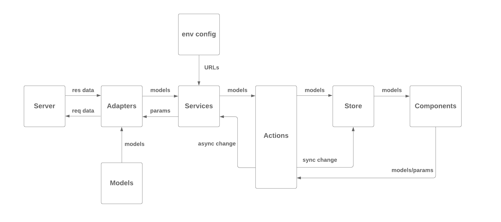

This project was bootstrapped with [Create React App](https://github.com/facebook/create-react-app).

## Structure

### Models
Client side data structures for logical objects.

### Adapters
Converters between server requests/responses and client models/parameters.

### Services
Functions to handle requests to server.

### Actions
Functions to update data with the redux store. Can be synchronous actions directly dispathed or asynchronous functions with side effects using thunk middleware.

### Store
Redux store with reducers.

### Components
React components to form pages. Can be container class or functional components with hooks.

## Development

In the project directory, you can run:

### `yarn start`

Runs the app in the development mode. 
Open the HOST url defined in .env.local to view it in the browser.

The page will reload if you make edits. 
You will also see any lint errors in the console.

## Test

### `yarn test`

Launches the test runner in the interactive watch mode. 
See the section about [running tests](https://facebook.github.io/create-react-app/docs/running-tests) for more information.

## Build

### `env-cmd .env.name yarn run build`

Builds the app for with the environment configuration in .env.name to the build folder.

## Eject dependency configs

### `yarn eject`

**Note: this is a one-way operation. Once you `eject`, you can’t go back!**

If you aren’t satisfied with the build tool and configuration choices, you can `eject` at any time. This command will remove the single build dependency from your project.

Instead, it will copy all the configuration files and the transitive dependencies (Webpack, Babel, ESLint, etc) right into your project so you have full control over them. All of the commands except `eject` will still work, but they will point to the copied scripts so you can tweak them. At this point you’re on your own.

You don’t have to ever use `eject`. The curated feature set is suitable for small and middle deployments, and you shouldn’t feel obligated to use this feature. However we understand that this tool wouldn’t be useful if you couldn’t customize it when you are ready for it.

## Coding Style：

### React Component Style: [piotrwitek/react-redux-typescript-guide](https://github.com/piotrwitek/react-redux-typescript-guide)

### JS Style: [Google JavaScript Style Guide](https://google.github.io/styleguide/jsguide.html#file-copyright)